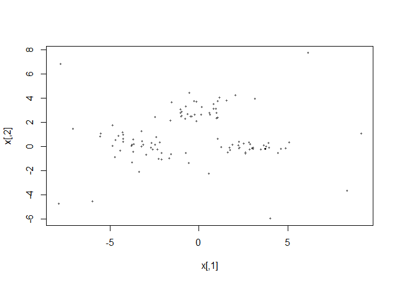
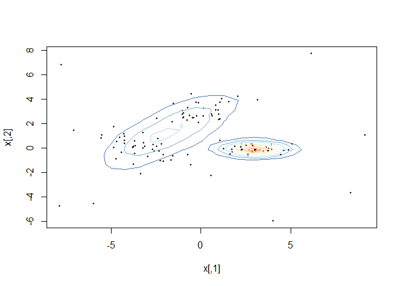
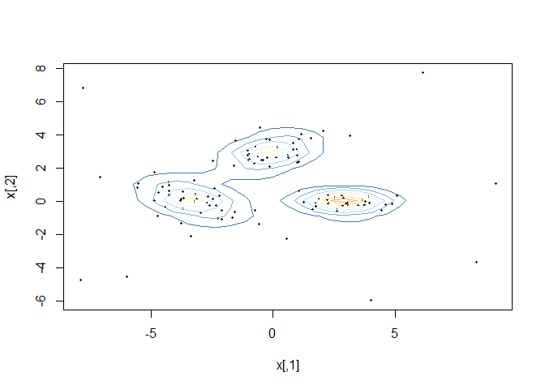

t Mixture Model
================

# Model

Say we have a set of 
dimensional observations . A t Mixture Model
(tMM) is a parametric probabilistic model that assumes each observation,
, is generated from a finite mixture of multivariate
t distributions. Unlike Gaussian Mixture models (GMMs), tMMs are robust
to outliers, and as such can be used as a robust method of clustering.
This robustness, however, comes at a computational expense.

A random vector
 of dimension
 is said to follow a
multivariate t distribution, "),x\`
if the probability density function of
 is:

  
![f\_{\\boldsymbol{T}}(\\boldsymbol{x}| \\boldsymbol{\\mu},
\\boldsymbol{\\Sigma}, \\nu) = \\frac{\\Gamma\[(\\nu +
p)/2\]}{\\Gamma(\\nu/2)\\nu^{p/2}\\lambda^{p/2}
|\\boldsymbol{\\Sigma}|^{\\frac{1}{2}}} \\left\[1 +
\\frac{1}{\\nu}(\\boldsymbol{x} - \\boldsymbol{\\mu})^T \\boldsymbol
{\\Sigma^{-1}}(\\boldsymbol{x} - \\boldsymbol{\\mu})
\\right\]^{-(\\nu+p)/2}](https://latex.codecogs.com/png.latex?f_%7B%5Cboldsymbol%7BT%7D%7D%28%5Cboldsymbol%7Bx%7D%7C%20%5Cboldsymbol%7B%5Cmu%7D%2C%20%5Cboldsymbol%7B%5CSigma%7D%2C%20%5Cnu%29%20%3D%20%5Cfrac%7B%5CGamma%5B%28%5Cnu%20%2B%20p%29%2F2%5D%7D%7B%5CGamma%28%5Cnu%2F2%29%5Cnu%5E%7Bp%2F2%7D%5Clambda%5E%7Bp%2F2%7D%20%7C%5Cboldsymbol%7B%5CSigma%7D%7C%5E%7B%5Cfrac%7B1%7D%7B2%7D%7D%7D%20%20%5Cleft%5B1%20%2B%20%5Cfrac%7B1%7D%7B%5Cnu%7D%28%5Cboldsymbol%7Bx%7D%20-%20%5Cboldsymbol%7B%5Cmu%7D%29%5ET%20%5Cboldsymbol%20%7B%5CSigma%5E%7B-1%7D%7D%28%5Cboldsymbol%7Bx%7D%20-%20%5Cboldsymbol%7B%5Cmu%7D%29%20%5Cright%5D%5E%7B-%28%5Cnu%2Bp%29%2F2%7D
"f_{\\boldsymbol{T}}(\\boldsymbol{x}| \\boldsymbol{\\mu}, \\boldsymbol{\\Sigma}, \\nu) = \\frac{\\Gamma[(\\nu + p)/2]}{\\Gamma(\\nu/2)\\nu^{p/2}\\lambda^{p/2} |\\boldsymbol{\\Sigma}|^{\\frac{1}{2}}}  \\left[1 + \\frac{1}{\\nu}(\\boldsymbol{x} - \\boldsymbol{\\mu})^T \\boldsymbol {\\Sigma^{-1}}(\\boldsymbol{x} - \\boldsymbol{\\mu}) \\right]^{-(\\nu+p)/2}")  

Where
 is a  location vector,
 is a 
positive definite scale matrix and
, the degrees
of freedom, is a positive real number.

A random vector
 is said to be
 component finite
mixture of multivariate 
distributions if the probability density function of
 is given by:

  
 = \\sum_{g=1}^G \\lambda_g f_{\\boldsymbol{T_g}}(\\boldsymbol{x} | \\boldsymbol{\\mu_g}, \\boldsymbol{\\Sigma_g}, \\nu_g ) 
")  

where

  
, \\quad \\sum_{g=1}^G \\lambda_g = 1, \\quad 0 \\leq \\lambda_g \\leq 1, \\forall g
")  

# Parameter Estimation

The parameters of the model are  for
 (,
the number of components, is assumed to be known) and are estimated
using maximum likelihood. However, the likelihood function is difficult
to maximize using standard methods and so a special case of the
minorize-maximize algorithm, the Expectation Maximization (EM)
algorithm, is used. The EM algorithm is an iterative algorithm in which
the parameters of the model are updated at each iteration (divided into
an E-step and then an M-step) until a specified stopping criterion. Like
many iterative algorithms the EM algorithm requires a starting estimate
for the parameters. One of the advantages of the EM algorithm is that
the parameter estimates at each iteration of the algorithm are
guaranteed to yield a greater log likelihood than the parameter
estimates of the previous iteration, a consequence of Jensen’s
Inequality. The parameter estimates at each iteration are as follows:

**E step**

The values computed in the E-step are to compute the parameter estimates
in the M-step.

  
![
E\[Z\_{ig}|\\boldsymbol{X\_i}\] = \\frac{\\lambda\_g
f\_{\\boldsymbol{T\_g}}(\\boldsymbol{X\_i})}{\\sum\_{g=1}^G \\lambda\_g
f\_{\\boldsymbol{T\_g}}(\\boldsymbol{X\_i})}, \\quad \\forall i,g
](https://latex.codecogs.com/png.latex?%0AE%5BZ_%7Big%7D%7C%5Cboldsymbol%7BX_i%7D%5D%20%3D%20%20%5Cfrac%7B%5Clambda_g%20f_%7B%5Cboldsymbol%7BT_g%7D%7D%28%5Cboldsymbol%7BX_i%7D%29%7D%7B%5Csum_%7Bg%3D1%7D%5EG%20%5Clambda_g%20f_%7B%5Cboldsymbol%7BT_g%7D%7D%28%5Cboldsymbol%7BX_i%7D%29%7D%2C%20%5Cquad%20%5Cforall%20i%2Cg%0A
"
E[Z_{ig}|\\boldsymbol{X_i}] =  \\frac{\\lambda_g f_{\\boldsymbol{T_g}}(\\boldsymbol{X_i})}{\\sum_{g=1}^G \\lambda_g f_{\\boldsymbol{T_g}}(\\boldsymbol{X_i})}, \\quad \\forall i,g
")  

  
![
E \\left\[U\_{ig}| \\boldsymbol{X\_i}, \\boldsymbol{Z\_i} \\right\] =
\\frac{v\_g + p}{ \\nu\_{g} + (\\boldsymbol{X\_i} -
\\boldsymbol{\\mu\_{g}})^T
\\boldsymbol{\\Sigma\_{g}}^{-1}(\\boldsymbol{X\_i} -
\\boldsymbol{\\mu\_{g}})}, \\quad \\forall i,g
](https://latex.codecogs.com/png.latex?%0AE%20%5Cleft%5BU_%7Big%7D%7C%20%5Cboldsymbol%7BX_i%7D%2C%20%5Cboldsymbol%7BZ_i%7D%20%20%5Cright%5D%20%3D%20%5Cfrac%7Bv_g%20%2B%20p%7D%7B%20%5Cnu_%7Bg%7D%20%2B%20%28%5Cboldsymbol%7BX_i%7D%20-%20%5Cboldsymbol%7B%5Cmu_%7Bg%7D%7D%29%5ET%20%5Cboldsymbol%7B%5CSigma_%7Bg%7D%7D%5E%7B-1%7D%28%5Cboldsymbol%7BX_i%7D%20-%20%5Cboldsymbol%7B%5Cmu_%7Bg%7D%7D%29%7D%2C%20%5Cquad%20%5Cforall%20i%2Cg%0A
"
E \\left[U_{ig}| \\boldsymbol{X_i}, \\boldsymbol{Z_i}  \\right] = \\frac{v_g + p}{ \\nu_{g} + (\\boldsymbol{X_i} - \\boldsymbol{\\mu_{g}})^T \\boldsymbol{\\Sigma_{g}}^{-1}(\\boldsymbol{X_i} - \\boldsymbol{\\mu_{g}})}, \\quad \\forall i,g
")  

") denotes the digamma function.

**M step**

  
![
\\hat \\lambda\_g = \\frac{\\sum\_{i=1}^n
E\[Z\_{ig}|\\boldsymbol{X\_i}\] }{n} = \\text{Ave}\_{i=1, \\dots,
n}(E\[Z\_{ig}|\\boldsymbol{X\_i}\]), \\quad \\forall g
](https://latex.codecogs.com/png.latex?%0A%5Chat%20%5Clambda_g%20%3D%20%5Cfrac%7B%5Csum_%7Bi%3D1%7D%5En%20E%5BZ_%7Big%7D%7C%5Cboldsymbol%7BX_i%7D%5D%20%7D%7Bn%7D%20%3D%20%5Ctext%7BAve%7D_%7Bi%3D1%2C%20%5Cdots%2C%20n%7D%28E%5BZ_%7Big%7D%7C%5Cboldsymbol%7BX_i%7D%5D%29%2C%20%5Cquad%20%5Cforall%20g%0A
"
\\hat \\lambda_g = \\frac{\\sum_{i=1}^n E[Z_{ig}|\\boldsymbol{X_i}] }{n} = \\text{Ave}_{i=1, \\dots, n}(E[Z_{ig}|\\boldsymbol{X_i}]), \\quad \\forall g
")  

  
![
\\hat {\\boldsymbol{\\mu\_g}} = \\frac{\\sum\_{i=1}^n
E\[Z\_{ig}|\\boldsymbol{X\_i}\] E \\left \[U\_{ig}| \\boldsymbol{X\_i},
\\boldsymbol{Z\_i}\\right\] \\boldsymbol{X\_i} } {\\sum\_{i=1}^n
E\[Z\_{ig}|\\boldsymbol{X\_i}\] E \\left \[U\_{ig}| \\boldsymbol{X\_i},
\\boldsymbol{Z\_i} \\right\] }, \\quad \\forall g
](https://latex.codecogs.com/png.latex?%0A%5Chat%20%7B%5Cboldsymbol%7B%5Cmu_g%7D%7D%20%3D%20%5Cfrac%7B%5Csum_%7Bi%3D1%7D%5En%20E%5BZ_%7Big%7D%7C%5Cboldsymbol%7BX_i%7D%5D%20%20E%20%5Cleft%20%5BU_%7Big%7D%7C%20%5Cboldsymbol%7BX_i%7D%2C%20%5Cboldsymbol%7BZ_i%7D%5Cright%5D%20%5Cboldsymbol%7BX_i%7D%20%7D%20%7B%5Csum_%7Bi%3D1%7D%5En%20E%5BZ_%7Big%7D%7C%5Cboldsymbol%7BX_i%7D%5D%20%20E%20%5Cleft%20%5BU_%7Big%7D%7C%20%5Cboldsymbol%7BX_i%7D%2C%20%5Cboldsymbol%7BZ_i%7D%20%5Cright%5D%20%7D%2C%20%5Cquad%20%5Cforall%20g%0A
"
\\hat {\\boldsymbol{\\mu_g}} = \\frac{\\sum_{i=1}^n E[Z_{ig}|\\boldsymbol{X_i}]  E \\left [U_{ig}| \\boldsymbol{X_i}, \\boldsymbol{Z_i}\\right] \\boldsymbol{X_i} } {\\sum_{i=1}^n E[Z_{ig}|\\boldsymbol{X_i}]  E \\left [U_{ig}| \\boldsymbol{X_i}, \\boldsymbol{Z_i} \\right] }, \\quad \\forall g
")  

  
![
\\hat {\\boldsymbol{\\Sigma\_g}} = \\frac{\\sum\_{i=1}^n
E\[Z\_{ig}|\\boldsymbol{X\_i}\]E \\left \[U\_{ig}| \\boldsymbol{X\_i},
\\boldsymbol{Z\_i} \\right\](\\boldsymbol{X\_i} - {\\boldsymbol{\\hat
\\mu\_g}})(\\boldsymbol{X\_i} - {\\boldsymbol{\\hat
\\mu\_g}})^T}{\\sum\_{i=1}^n E\[Z\_{ig}|\\boldsymbol{X\_i}\] }, \\quad
\\forall g
](https://latex.codecogs.com/png.latex?%0A%5Chat%20%7B%5Cboldsymbol%7B%5CSigma_g%7D%7D%20%3D%20%5Cfrac%7B%5Csum_%7Bi%3D1%7D%5En%20E%5BZ_%7Big%7D%7C%5Cboldsymbol%7BX_i%7D%5DE%20%5Cleft%20%5BU_%7Big%7D%7C%20%5Cboldsymbol%7BX_i%7D%2C%20%5Cboldsymbol%7BZ_i%7D%20%5Cright%5D%28%5Cboldsymbol%7BX_i%7D%20-%20%7B%5Cboldsymbol%7B%5Chat%20%5Cmu_g%7D%7D%29%28%5Cboldsymbol%7BX_i%7D%20-%20%7B%5Cboldsymbol%7B%5Chat%20%5Cmu_g%7D%7D%29%5ET%7D%7B%5Csum_%7Bi%3D1%7D%5En%20E%5BZ_%7Big%7D%7C%5Cboldsymbol%7BX_i%7D%5D%20%7D%2C%20%5Cquad%20%5Cforall%20g%0A
"
\\hat {\\boldsymbol{\\Sigma_g}} = \\frac{\\sum_{i=1}^n E[Z_{ig}|\\boldsymbol{X_i}]E \\left [U_{ig}| \\boldsymbol{X_i}, \\boldsymbol{Z_i} \\right](\\boldsymbol{X_i} - {\\boldsymbol{\\hat \\mu_g}})(\\boldsymbol{X_i} - {\\boldsymbol{\\hat \\mu_g}})^T}{\\sum_{i=1}^n E[Z_{ig}|\\boldsymbol{X_i}] }, \\quad \\forall g
")  

The estimate for the
’s must
be found by solving the following univariate equations for each
:

  
![
\\log{(\\frac{\\nu}{2})} - \\psi(\\frac{\\nu}{2}) + 1 -
\\log{(\\frac{\\nu\_i + p}{2})} +\\frac{\\sum\_{i=1}^n
E\[Z\_{ig}|\\boldsymbol{X\_i}\] (\\log{(E \\left \[U\_{ig}|
\\boldsymbol{X\_i}, \\boldsymbol{Z\_i} \\right\])} - E \\left \[U\_{ig}|
\\boldsymbol {X\_i}, \\boldsymbol{Z\_i} \\right\])} {\\sum\_{i = 1}^n
E\[Z\_{ig}|\\boldsymbol{X\_i}\]} = 0
](https://latex.codecogs.com/png.latex?%0A%5Clog%7B%28%5Cfrac%7B%5Cnu%7D%7B2%7D%29%7D%20-%20%5Cpsi%28%5Cfrac%7B%5Cnu%7D%7B2%7D%29%20%2B%201%20-%20%5Clog%7B%28%5Cfrac%7B%5Cnu_i%20%2B%20p%7D%7B2%7D%29%7D%20%2B%5Cfrac%7B%5Csum_%7Bi%3D1%7D%5En%20E%5BZ_%7Big%7D%7C%5Cboldsymbol%7BX_i%7D%5D%20%28%5Clog%7B%28E%20%5Cleft%20%5BU_%7Big%7D%7C%20%5Cboldsymbol%7BX_i%7D%2C%20%5Cboldsymbol%7BZ_i%7D%20%5Cright%5D%29%7D%20-%20E%20%5Cleft%20%5BU_%7Big%7D%7C%20%5Cboldsymbol%20%20%7BX_i%7D%2C%20%5Cboldsymbol%7BZ_i%7D%20%5Cright%5D%29%7D%20%7B%5Csum_%7Bi%20%3D%201%7D%5En%20E%5BZ_%7Big%7D%7C%5Cboldsymbol%7BX_i%7D%5D%7D%20%3D%200%0A
"
\\log{(\\frac{\\nu}{2})} - \\psi(\\frac{\\nu}{2}) + 1 - \\log{(\\frac{\\nu_i + p}{2})} +\\frac{\\sum_{i=1}^n E[Z_{ig}|\\boldsymbol{X_i}] (\\log{(E \\left [U_{ig}| \\boldsymbol{X_i}, \\boldsymbol{Z_i} \\right])} - E \\left [U_{ig}| \\boldsymbol  {X_i}, \\boldsymbol{Z_i} \\right])} {\\sum_{i = 1}^n E[Z_{ig}|\\boldsymbol{X_i}]} = 0
")  

# Application

In order to demonstrate the tMM’s robustness to outliers, we will
simulate 100 points from a GMM (bivariate, 3 componenets, equal mixing
probabilities), add 10 points as noise (sampled from a uniform
distribution) and assess the fit of both a GMM and a tMM.

``` r
#install package
devtools::install_github('AshwinPuri13/tMM')
```

``` r
library(RColorBrewer)
library(MASS)
suppressWarnings(library(mixtools))
```

    ## mixtools package, version 1.2.0, Released 2020-02-05
    ## This package is based upon work supported by the National Science Foundation under Grant No. SES-0518772.

``` r
set.seed(5)

mu1 = c(0, 3)
mu2 = c(3, 0)
mu3 = c(-3, 0)

sigma1 = matrix( c(2, 0.5, 0.5, 0.5), nrow =2)
sigma2 = matrix( c(1,0,0,0.1), nrow = 2)
sigma3 = matrix( c(2, -0.5, -0.5, 0.5), nrow =2)


lambda0 = c(1,1,1)/3
mu0 = list(mu1, mu2, mu3)
sigma0 = list(sigma1, sigma2, sigma3)

rmvnormmix = function(n, lambda, mu, sigma) {
  G = length(lambda)
  t(sapply(1:n, function(...) {
  Zi = sample(x = 1:G, size = 1, prob = lambda)
  rmvnorm(n = 1, mu = mu[[Zi]], sigma = sigma[[Zi]])
  }))
}

e = cbind(runif(n = 10, min = -10, max = 10), runif(n = 10, min = -10, max = 10))
x = rbind(rmvnormmix(n = 100, lambda = lambda0, mu = mu0, sigma = sigma0), e)

plot(x, cex = 0.4)
```

<!-- -->

First, using the mixtools package, we fit a GMM with 3 components:

``` r
theta.GMM = mvnormalmixEM(x = x, k = 3)
```

    ## number of iterations= 46

``` r
fit.GMM = rmvnormmix(n = 10000, lambda = theta.GMM$lambda, mu = theta.GMM$mu, sigma = theta.GMM$sigma)

z = kde2d(fit.GMM [,1], fit.GMM [,2], n = 50)

my.cols = rev(c("black", "black", "gray", "purple", "red", brewer.pal(11, "RdYlBu")))
plot(x, pch = 19, cex = .4)

contour(z, drawlabels = FALSE, nlevels = 11, col = my.cols, add = TRUE)
```

<!-- -->

Note that we have 2 concerns here:

1.  The GMM was poorly fit due to the added noise.

2.  We had to specify the exact number of components.

Next, fitting a tMM (where we specify the range of the number of
components to be 2,3,4):

``` r
library(tMM)

theta.tMM = mvtmixEM(x = x, G_range = 2:4)

fit.tMM =  rmvtmix(n = 10000, mu = theta.tMM$mu, sigma = theta.tMM$sigma, 
                   nu = theta.tMM$nu, lambda = theta.tMM$lambda)

z = kde2d(fit.tMM[,1], fit.tMM[,2], n = 500)

plot(x, pch =19, cex = .4)

print(paste0('Number of components :', theta.tMM$G))
```

    ## [1] "Number of components :3"

``` r
contour(z, drawlabels = FALSE, nlevels = 11, col = my.cols, add=TRUE)
```

<!-- -->
